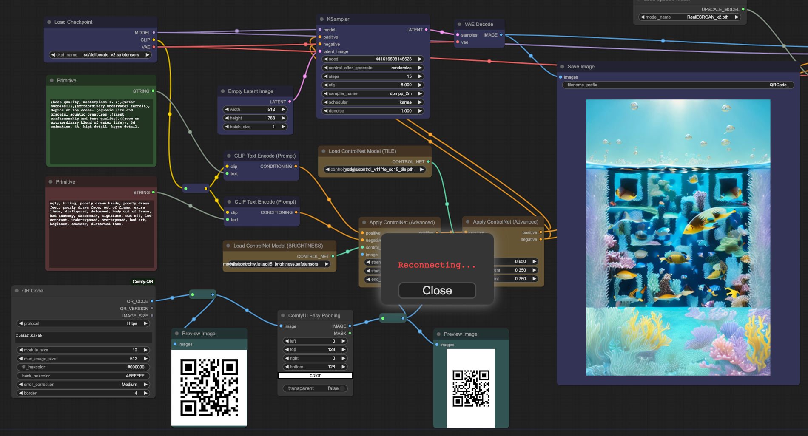
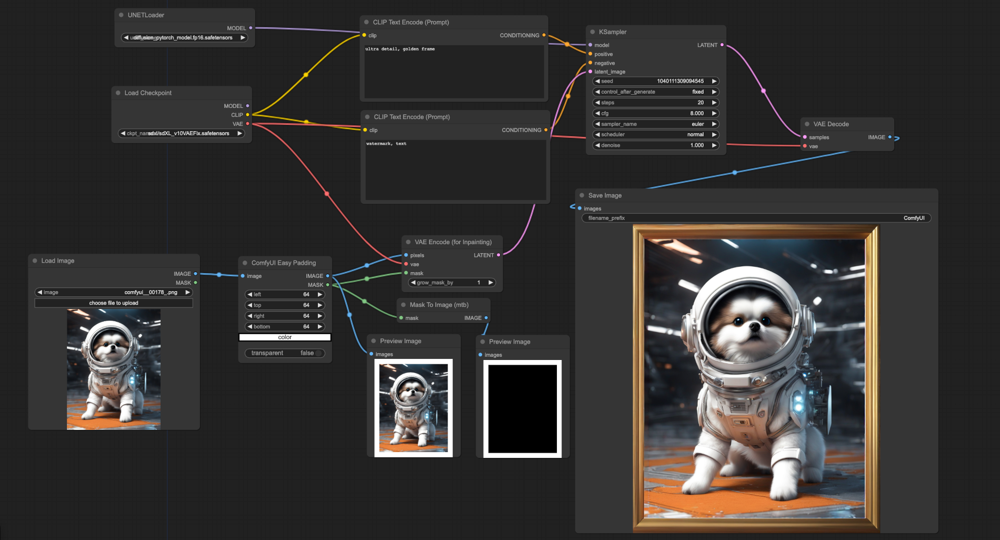

# ComfyUI Easy Padding

ComfyUI Easy Padding is a simple custom ComfyUI node that helps you to add padding to images on ComfyUI.

QR Code Examples;

SDXL Inpainting Examples;

## Getting started

This project currently contains one node.

### ComfyUI Easy Padding

#### Inputs

* `image` - Image input - Image
* `left` - Left padding - INT
* `top` - Top padding - INT
* `right` - Right padding - INT
* `bottom` - Bottom padding - INT
* `color` - Canvas color for padding area - Color
* `transparency` - It changes canvas color to transparent for padding area - Boolean

#### Outputs

* `IMAGE` - New image
* `MASK` - Mask for impainting models 